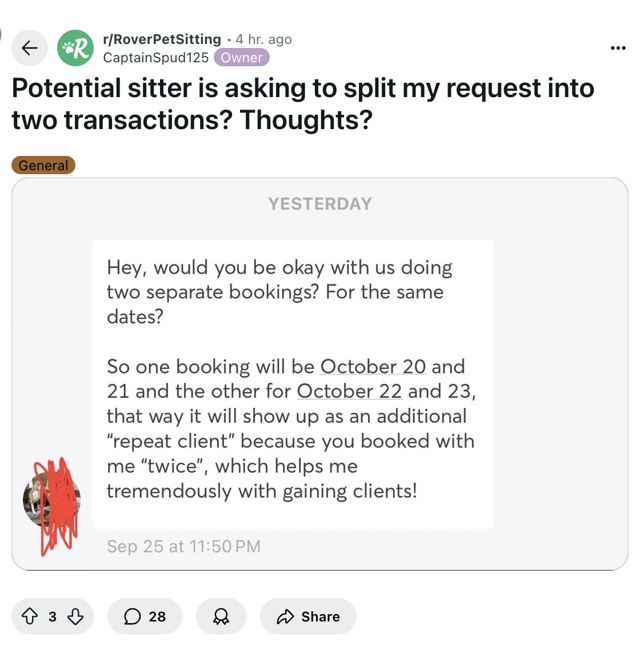
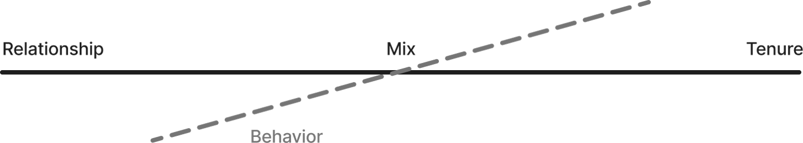
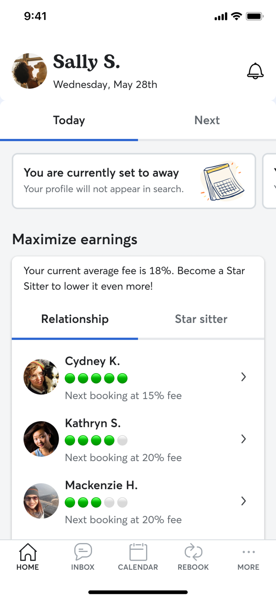
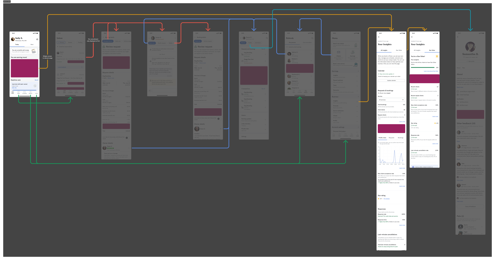

# Design exploration: graduated take rate

**URL:** https://roverdotcom.atlassian.net/wiki/spaces/PSD/pages/5069046793  
**Author:** Bernardo Prudêncio | **Last modified:** Apr 22, 2026

---

## Graduated take rate

This document explores design options for a graduated take rate model. Our goal is to identify and evaluate approaches that balance business objectives with user experience.

All designs are just concept explorations.

## Insights and ideas

- Most sitters are aware that Rover charges a service fee, but fewer understand the exact percentage being deducted from their earnings. [https://roverdotcom.atlassian.net/wiki/spaces/DSN/pages/4951639504](https://roverdotcom.atlassian.net/wiki/spaces/DSN/pages/4951639504)
- The T&S team has seen a handful of recent incidents with Star Sitters who have been offering care for 3 months or less. [https://roverdotcom.atlassian.net/wiki/spaces/MARKET/pages/5010851492](https://roverdotcom.atlassian.net/wiki/spaces/MARKET/pages/5010851492)
- _We believe_ the potential to earn a specific reward that you have to work towards will increase interest in understanding the details, therefore it will increase awareness and comprehension.
- Based on the feedback we have been seeing on social media, Star Sitter today seems to be "happening" to sitters without them ever trying - it's cycling naturally. The value of it is also fuzzy.
- When there's a tenure component, we believe it will make newer sitters more careful to divert, even in cases when then owner triggers it (i.e:. won't divert to get to the xth booking faster).
- _We believe_ the 0% goal, even if unattainable could be a great driver of behavior.
- [Repeat vs. Acquisition](https://roverdotcom.atlassian.net/wiki/spaces/MARKET/blog/2025/09/18/5096604080) · There is a fundamental split in business models between continents:

  - **North America:** Top sitters are **repeat**-driven, earning the majority of their income from existing clients. This repeat-focused business happens only for the top 16-19% of sitters. If this is the case, the impact of a graduated take might be less as they are already repeat-driven, but it matches their current behavior and we might be able to extend the repeat concept.
  - **Europe**: Top sitters are **acquisition**-driven, relying on a constant stream of new clients. They rarely cross the threshold to a repeat-focused business, even at the highest percentiles. If this is the case, we might drive more diversion because of the first booking increase in take, but might be interested because repeats might start happening on platform.
- Our hope is impacting bookings of owners that repeat services within enough frequency (we assume Rover is their plan A).

## Levers

On one end, we have relationship-based models, where the take rate varies between a sitter and client based on completed bookings, units or something like GBV (e.g., a higher take rate for the first booking than for the second). On the other end are tenure-based models, where the take rate decreases with the sitter's experience or total bookings (e.g., the first booking is x%, the tenth is y%).

Additionally, we consider a diagonal axis of behavioral factors. For example, we could assign different take rates based on sitter performance or status.

We can also combine these approaches. We can introduce models that consider a combination of relationship, tenure, and behavioral factors. These models can be simple or sophisticated, allowing us to adjust the take rate based on a blend of a sitter's tenure, client relationships, and performance.

This exploration aims to outline these options and provide a framework for decision-making as we refine our graduated take rate approach.

---

_Relationship page mock-up_

### Relationship-based

Relationship-based models focus on the sitter-client dynamic, adjusting the take rate as their relationship grows. Typically, the take rate decreases with more client bookings, structured per booking or after a set number (e.g:. every 5th booking). 

However, current sitter-client dynamics show that sitters often use Rover for the first booking to secure a review and trust. There are also signals that tell us a second booking occurs on-platform for repeat metrics. After initial bookings, the incentive to book through Rover may decrease if the take rate is high. **A graduated, relationship-based model could encourage continued bookings on Rover by lowering the take rate with each subsequent booking.**

See more about assessing criteria for a relationship based take rate [here](https://roverdotcom.atlassian.net/wiki/spaces/PSD/pages/5044109324). 

_Relationship touch points_

A relationship-based model can use existing touch points, but the experience may be subpar. Currently, we lack a central place to evaluate a relationship's history (bookings, transactions, shared media, etc.). Creating or iterating on dedicated touch points becomes more or less critical depending on the measurement unit. For example, if we use Gross Booking Value (GBV), a relationship page to assess client-sitter transactions is essential.

A **relationship page** or a client dedicated space to track progress **may be a must.**

#### Deep diving in GBV as a criteria  

[https://roverdotcom.atlassian.net/wiki/spaces/PSD/pages/5201496498](https://roverdotcom.atlassian.net/wiki/spaces/PSD/pages/5201496498) 

---

_Total clients mock-up_

### Tenure-based

A take rate model that decreases solely with tenure rewards sitters for staying active on the platform. However, this approach doesn't address diversion: sitters could use Rover mainly to acquire new clients, then move bookings off-platform as their costs drop.

For this reason, **tenure-based incentives should be combined with relationship or behavioral criteria to better align incentives, encourage loyalty, and reduce diversion risk.**

[See example from Preply](https://roverdotcom.slack.com/archives/C09KRSDT52M/p1760522710031529): [https://help.preply.com/en/articles/4171383-preply-commission-model](https://help.preply.com/en/articles/4171383-preply-commission-model) 

#### Recency criteria

We can add a recency layer to the model. While this risks driving users off-platform, it could prevent gaming.

_Tenure touchpoints_

#### Deep diving in GBV as a criteria  

[https://roverdotcom.atlassian.net/wiki/spaces/PSD/pages/5215357278](https://roverdotcom.atlassian.net/wiki/spaces/PSD/pages/5215357278) 

_Relationships and Star Sitter mock-up_

### Behavior-based

Promoting good behavior is a core goal for Rover, and the Star Sitter program is a natural anchor for this. While Star Sitter currently offers little value beyond the badge, we could link graduated take rate benefits to this status, such as unlocking lower rates faster or setting an aspirational 0% take rate for top performers.

_Behavior touch points_

## Considerations

### Audience

Layering relationships, tenure, and behavioral incentives motivates specific audiences. Relying only on tenure is insufficient; long-tenured sitters may not change their behavior for incentives. Relationship-based incentives may be best, as they focus on new relationships and reflect the platform's value versus cost.

### Measurement unit

#### Units and bookings

Tracking completed units adds complexity, as we must account for different unit types across bookings. Tracking bookings might be unfair to services such as overnight where repeat frequency isn't as high as daytime services.

#### GBV

Using relationship GBV requires tracking total earnings or payments exchanged between a client and a sitter over time. GBV with a multi-step approach might be interesting for overnight as we assume they care the most about the 20% fee (larger sum).

#### Points

We can use units, bookings, or GBV to design a point-based system, creating fairness across services.

### Make it aspirational

This dynamic approach could lower the take rate as much as to 3% for sitters with loyal clients. An aspirational goal could be a 0% take rate for the most loyal relationships, though we would have to make it nearly unattainable.

### Ongoing engagement

Focus on new bookings. Incentives should be ongoing (e.g:. every new relationship must meet criteria) or reset periodically. Avoid models where criteria, once met, do not require future action.

### Giving a choice to the sitter

We could let the sitter decide. We could offer a 20% flat rate or a more appealing take rate with upfront costs. This resembles subscriptions.

### Gaming the system

The potential for system manipulation varies by model. Behavior-based incentives are the most difficult to manipulate. Using GBV might be best as you don't play around with money.

## Questions

- How will we define and calculate abstract concepts like "tenure" and "recency"?
- What happens if a booking that qualified a sitter for a lower rate is cancelled or refunded?
- What is the lowest % take we can get to in a graduated take rate? 5%? 3%? 0%?
- What does repeat-driven mean? Is it 2nd and 3rd booking?

## Explorations

**Initial explorations**

| **Idea** | **Example** | **Rel.** | **Tenure** | **Behavior** |
| --- | --- | --- | --- | --- |
| Decrease take per booking on a relationship level | Everyone: 30% → 25% → 20% → … → 3% | x | | |
| Decrease take on 3rd booking / after $1k GBV / after 20 units | Everyone: 30% → 15% | x | | |
| Decrease take after xth bookings | Everyone: 30% → 15% | | x | |
| Different take within different time periods | Less than one year: 30%, Between 1st and 2nd year: 25%, Past 2nd year: 15% | | x | |

### Comparison

| **Model** | **Experience** | **Pros** | **Cons / risks** |
| --- | --- | --- | --- |
| Relationship | "The more I book with the same client, the more I earn from them." | Simple to understand: directly ties the reward to the action we want (on-platform rebooking) | Doesn't reward overall loyalty |
| Relationship GBV | "After I earn my first $1,000 with a client, my fees for them drop permanently." | Rewards high-value relationships | Complex to track; favors high-cost services |
| Tenure | "The longer I'm active on the platform, the lower my fees get." | Rewards platform loyalty; simple logic | High diversion risk; penalizes new sitters |
| Behavior | "Because I'm a Star Sitter, I get a lower fee." | Rewards quality; makes Star Sitter meaningful | Could demotivate sitters who lose status |

### Possible recommendation

#### **MVP: Relationship-base model**

- **What it is:** A sitter's platform fee will decrease based on repeat bookings with the same client.
- **Example:**
  - Booking 1 or 10 units with a client: Higher 30% fee.
  - Bookings 2-4 or 11 to 20 units with that client: Standard 20% fee.
  - Bookings 5+ or 21+ units with that client: Lowest 15% fee.

#### **MLP: Use relationships GBV**

- **What it is:** A sitter's platform fee will decrease based on GBV transactions between pet parent and provider.
- **Example:**
  - $500 with a client: higher 30% fee.
  - $501 to $1k with a client: 20% fee.
  - $1k to $1.5k with a client: 15% fee.

#### **Iteration: Point system to balance different costs of services**

- 1 point for every $100 spent on overnight services, $40 on daycare or $20 spent on visit/walk
- -2% Rover fee for every 100 points
- Minimum of 3% Rover fee

#### **Iteration: Introduce behavior-based layer**

- Star Sitter pays only 27% on their first booking with a new client (vs 30% for regular sitters)

## Touchpoints

| **Touchpoint** | **Goal** |
| --- | --- |
| Home | Education. Progress tracker. |
| Inbox | Nudge sitters to rebook to get a lower take rate next. |
| Conversation | Nudge sitters to rebook to get a lower take rate next and progress reinforcement. |
| Booking details | Display what booking number this is and what is the take rate. |
| Pre-commit screen | Display what booking number this is and what is the take rate. |
| Rebook | Display client list and how much they earn per client. Nudge them to rebook. |
| Client list | Display client list and how much they earn per client. Nudge them to rebook. |
| Relationship | Display bookings and progress tracker. |
| Sitter insights | Display how many bookings or how long they have been on platform |
| Star Sitter insights | Display Star Sitter status. |

### Extras

Relationship or tenure models can enhance the sitter experience and boost engagement. Celebrating milestones, such as a sitter's 10th booking with a client, through achievements or shareable artifacts fosters loyalty. Incorporating gamification tactics like progress trackers and celebratory messages at key touchpoints motivates sitters to pursue their next booking.

## Appendix

