# Deep-dive: relationship-based

**URL:** https://roverdotcom.atlassian.net/wiki/spaces/PSD/pages/5201496498  
**Author:** Bernardo Prudêncio | **Last modified:** Nov 13, 2025

---

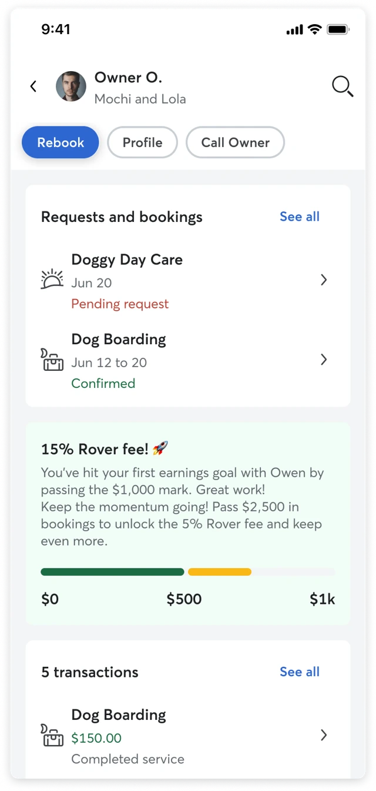
_Relationship page mock-up_

Relationship-based models focus on the sitter-client dynamic, adjusting the take rate as their relationship grows. Typically, the take rate decreases with more client bookings, structured per booking or after a set number (e.g:. every 5th booking). 

However, current sitter-client dynamics show that sitters often use Rover for the first booking to secure a review and trust. There are also signals that tell us a second booking occurs on-platform for repeat metrics. After initial bookings, the incentive to book through Rover may decrease if the take rate is high. **A graduated, relationship-based model could encourage continued bookings on Rover by lowering the take rate with each subsequent booking.**

See more about assessing criteria for a relationship based take rate [here](https://roverdotcom.atlassian.net/wiki/spaces/PSD/pages/5044109324). 

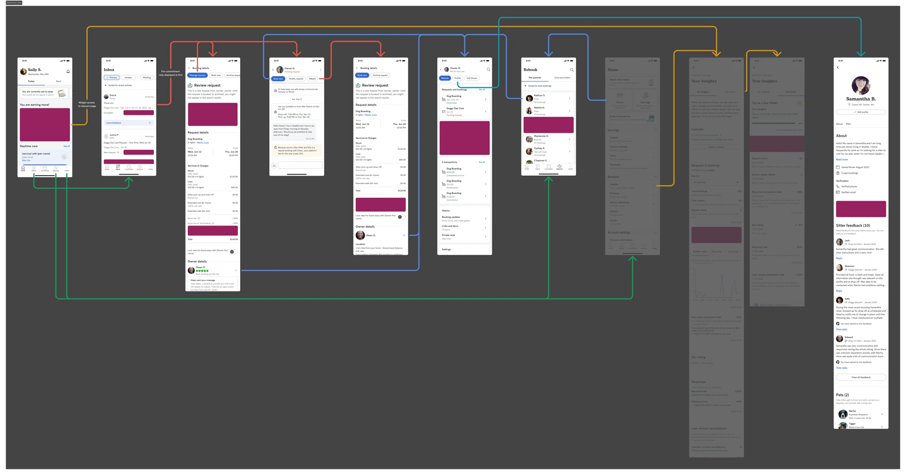
_Relationship touch points_

## Deep diving in GBV as a criteria

We will use GBV milestones. We also favor Canada as the test market due to its similarities to the USA. On the [analytics side](https://docs.google.com/document/d/1GZpzZLHUmkDF8PZCRrLNP8ca1O5x8y6SHCKYjQrgfP8/edit?tab=t.0#heading=h.mf5f3za7dqeu), we will consider two milestones (three take rates) and use both completed bookings and cancellation penalties in the relationship GBV.

### Tracking GBV and relationships

**Sitters can't see GBV per client.** Booking totals or cancellation fees show only in payment history or conversations. Since GBV affects the take rate, sitters need better client transaction access to resolve issues.

Solutions include adding client filters in **payment history** or inbox to view **booking details** (both are cumbersome and show only past data), adding total GBV to each request/booking showing amount at request time, redesigning the **Rebook tab** to highlight a client GBV tab, or creating a **relationship page** that centralizes bookings, requests, take status, and transactions.

Spreadsheet explorations:
- [https://docs.google.com/spreadsheets/d/1hb-i3PD1WW4GgzRh20y6NC2da_nBghfgM0kOYUSPkAs/edit?gid=1984665252#gid=1984665252](https://docs.google.com/spreadsheets/d/1hb-i3PD1WW4GgzRh20y6NC2da_nBghfgM0kOYUSPkAs/edit?gid=1984665252#gid=1984665252)
- [https://docs.google.com/spreadsheets/d/1ov9sByjU5GMMPM-VyH4h9Ne3_hS4p3FlqKLCZRnpe_A/edit?gid=1984665252#gid=1984665252](https://docs.google.com/spreadsheets/d/1ov9sByjU5GMMPM-VyH4h9Ne3_hS4p3FlqKLCZRnpe_A/edit?gid=1984665252#gid=1984665252)

Mockup options:

**Payment history**
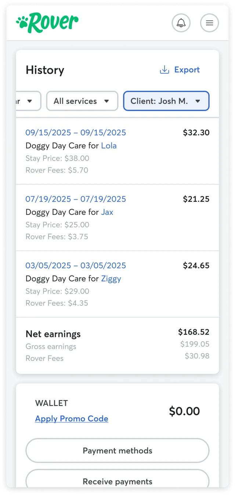

**Booking details**
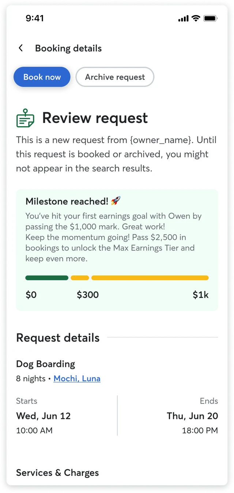

**Rebook**
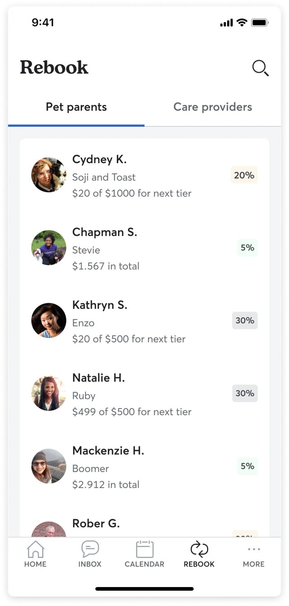

**Relationship**
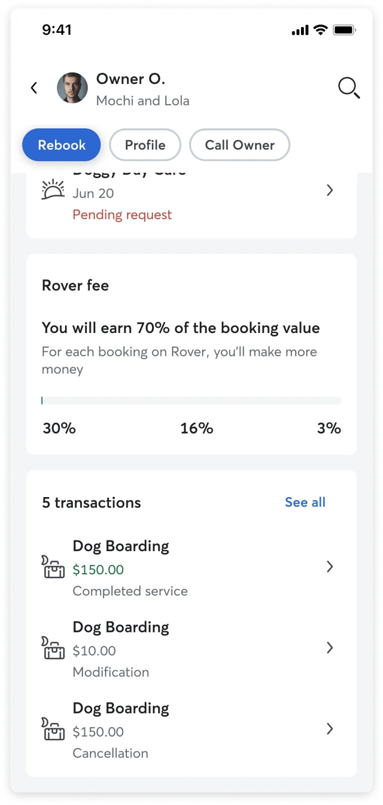

### Relationship page

The relationship page may best meet our design goals.

- **MUST** Sitters must know how and when they'll gain more value
- **MUST** New and existing sitters must know they're rewarded for keeping bookings on platform
- **MUST** Everything should focus on the relationship level

We agreed this touchpoint is needed both before and after the test for comprehension, pending research. It may be the best option in terms of effort since the current Rebook page, which could serve a similar purpose, is in native code and costly to optimize.

The MVP should have a quick rebook option, access to owner/sitter profiles, requests/bookings, and transactions. We should focus on what's needed to track progress toward a lower take rate.

> Visibility of status: this principle states that the system should always keep the user informed about what is going on through appropriate and timely feedback. The entire concept of tracking GBV requires making an invisible system metric visible to the sitter.

### 1 vs 2+ milestones

One milestone means tracking is simpler. For example, with one milestone and take rates of 30 and 10, it's easy to show progress needed.

Starting with one milestone cuts touchpoints and early complexity but may not inspire the desired behaviour.

Two milestones add specificity with three take rates. Multi-step methods need precise touchpoints like a **relationship page**.

Mockups:

**Two milestones**
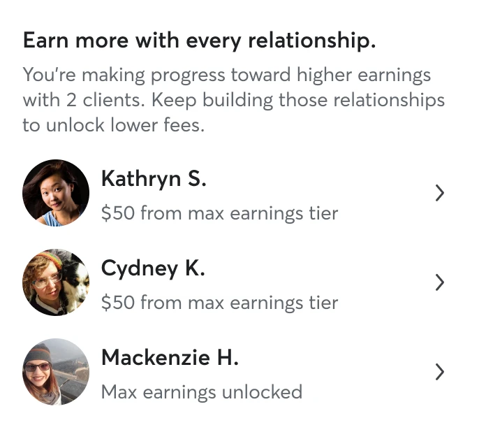

**Three milestones**

### Touchpoints

There's two communication concepts we need to explore. A **general one**, that allows us to tell new and existing sitters how the new take rate works. This can be as simple as just communication or we can start introducing the concept of tracking for the most recent clients.

Then, there's communication **focus on the relationship itself**. There's probably a need to have two different levels of complexity — a **compact**, for touchpoints such as inbox, booking details or client list page, and an **extended**, for touchpoints such as booking details or **relationship page**.

Mockups:

**General comms about how it works**
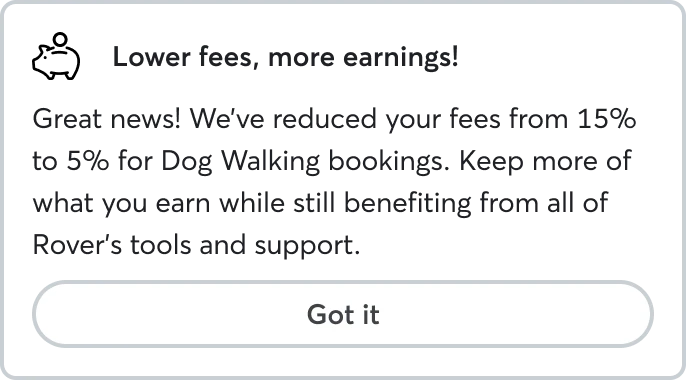

**General comms with relationship statuses**
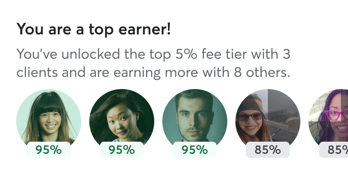

**Compact**
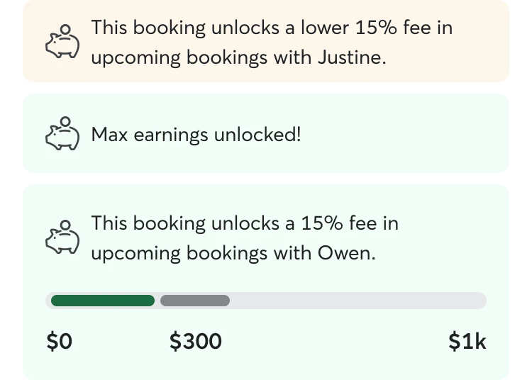

**Extended**
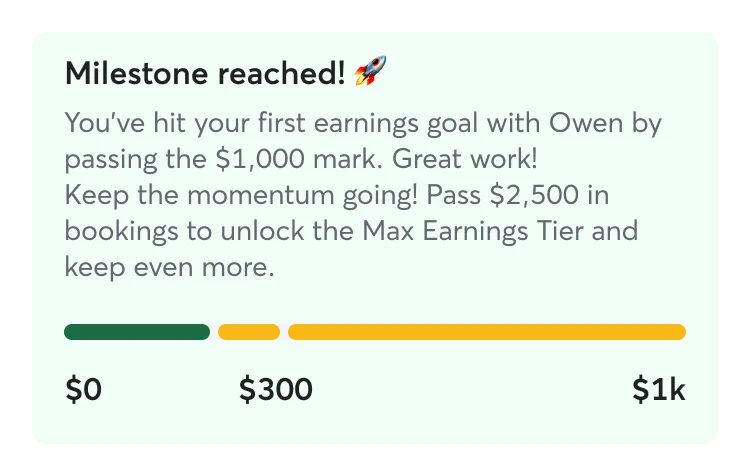

### Threshold-crossing bookings

A scenario we might have to design for is the moment a sitter's booking crosses a GBV threshold. How we handle the fee for these bookings have a significant impact on fairness, revenue, and our ability to drive retention. There's two approaches we can take on an experience level:

- **Splitting the fee** proportionally create the most transparent and fair model. The sitter receive the benefit the instant they earn it. However, this created a "blended fee" for a single booking that can be difficult to display clearly on a ledger or invoice, confusing sitters.
- We can **credit or cashback** on future bookings based on the "overpayment", having the entire booking charged at the current, higher fee. The sitter would have a tangible credit that they can redeem by completing another booking on our platform. However, this can feel unfair due to its delayed gratification nature.

When we consider an account level model, a sitter would only have as many booking that cross the threshold as milestone. On a **relationship level**, a sitter will cross these milestones over and over again with every client. This makes cashback a recurring, repeatable incentive loop.

Mockups:

**With and without splitting booking**
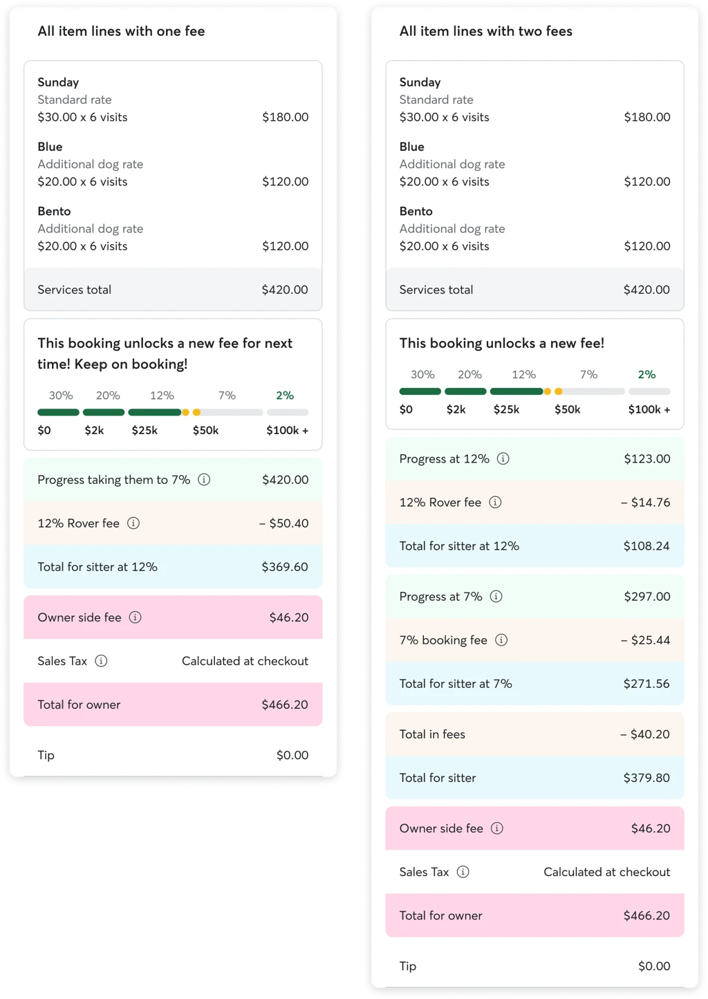

**Cash back on next booking**
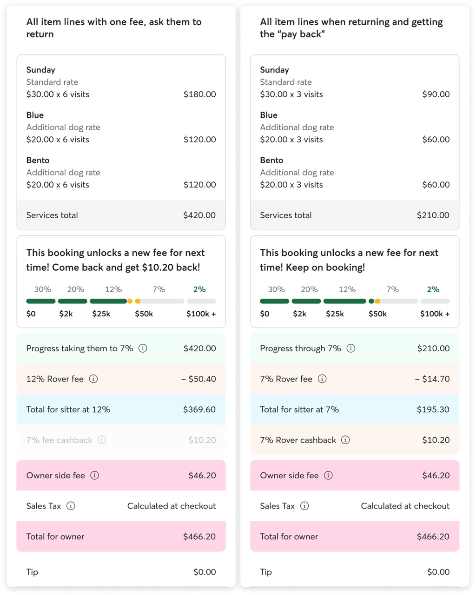

### Transparency

Include in all ledgers and payment history mentions to how much they are paying Rover (take) and what milestone they are at the moment of the booking.

### Communication

We must provide the right info as sitters' statuses change. Key scenarios and messaging:

**Onboarding and initial state** (set clear expectations for all sitters)
- All sitters in the test market get a one-time message about the new model.
- Existing relationships meeting GBV on day 1 are told their advanced status.
- Clarify that relationship GBV includes completed bookings and paid cancellation fees, excluding tips.
- Long-standing relationships count past GBV but past fees aren't refunded.

**The request loop** (help sitters decide)
- Bookings in first tier, hint to keep rebooking to get lower fee.
- ⚠️ Mention lower fees only if match quality is good; avoid encouraging bad relationships.
- Bookings in second tier, hint to keep rebooking to get lower fee.
- Bookings in lowest tier, great job!
- Booking that crosses a milestone, or two and that the fee is calculated proportionally.

**The recurring booking** (ongoing booking steps)
- Weekly updates for recurring bookings: first tier, second tier, third tier, crossing milestone, etc.
- Recurring booking is missing Rover Cards in previous weeks, and that needs to be solved.

**The modification use case** (inform sitters of changes, mainly owner changes)
- Request or booking was modified and fees were recalculated.

**Post booking updates** (immediate feedback on status changes)
- Booking was completed and fees were recalculated.
- Booking was cancelled, cancellation policy enforced and transaction counts towards progress.
- Booking was cancelled, cancellation policy was waived and transaction doesn't counts towards progress.

**High-level flow**

[Embedded Figma: https://www.figma.com/design/m3qiV0B3gQ2LABv0jyVgy3/-UX2-6175--Degressive-take-rate?node-id=214-96997&t=0LwmeWueJhQuCpo1-4]

## Meowtel

**FAQ** (Competitor comparison)

Our commission structure is based on your total reservation earnings with each client:

1. Tier 1: 30% commission for any client from whom you have earned $0-$299.
2. Tier 2: 25% commission for any client from whom you have earned between $300-$999.
3. Tier 3: 20% commission for any client from whom you have earned between $1,000-$2,999.
4. Tier 4: 15% commission for any client from whom you have earned over $3,000.

These commission tiers apply to a sitter's base rate and holiday surcharge. For example, if your 20-minute rate is $30 and your holiday surcharge is set at 30%, a 20-minute visit on December 25th with a brand new client will result in you taking home $27.30:

1. Base rate: $30.00
2. Holiday surcharge: 30% x $30 = $9.00
3. Total price: $39.00

Meowtel's commission @ Tier 1: 30%

**Your Earnings: $39.00 - ($39.00 x 30%) = $39.00 - $11.70 = $27.30.**

Tiers and commissions are calculated using earning data from all **past/completed** reservations. The moment a sitter accepts a reservation request, including any reservation modification requests, is when the tiers and earnings calculations take place for the new reservation.

Here's an example of what this could look like:

- On Dec 1st, client places Reservation #1 starting on Feb 1st, with planned earnings of $100 in Tier 1
- On Dec 20th, client places Reservation #2, starting on Jan 1st for 10 days, with planned earnings of $300 in Tier 1
- Reservation #2 is ending before Reservation #1 started and the sitter is now in Tier 2
- Reservation #1 will still be in Tier 1, as it was accepted on Dec 1st, when the sitter was in Tier 1

Tips are not counted towards client earning calculations since they are already commission-free. You can always check up on your commission tier progress with each client by visiting your [Clients](https://meowtel.com/sitter-dashboard/clients) screen.

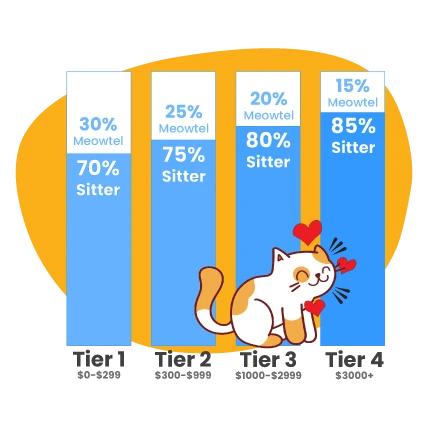
