# Design exploration: relationship-based graduated take with training service

**URL:** https://roverdotcom.atlassian.net/wiki/spaces/PSD/pages/5870324111  
**Author:** Bernardo Prudêncio | **Last modified:** Apr 30, 2026

---

# The problem

The graduated take structure uses relationship GBV thresholds to move sitters from a higher initial fee (30%) to lower tiers (15%, then 10%). This maps well to core services where relationships accumulate meaningful GBV over time. Training relationships don't follow this pattern.

## Current tier structure

| Tier | GBV range | Sitter fee | Training fit |
| --- | --- | --- | --- |
| Tier 1 | $0 – $499 | 30% | Almost all training stays here |
| Tier 2 | $500 – $999 | 15% | Rare |
| Tier 3 | $1,000+ | 10% | Extremely unlikely |

The total expected value of a training relationship is ~$500. Off-platform, trainers make $300–350 per client, but on Rover they book only $100–130. This means nearly all training bookings would be permanently stuck at the 30% tier — the highest fee — with no realistic path to lower tiers.

This creates churn risk for a service type that is already severely undersupplied.

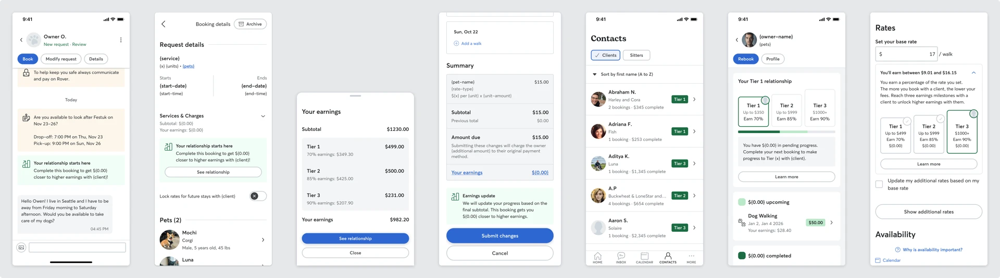
_Today's experience (see Figma spec)_

# What the data tells us

* Avg. training relationship GBV ~$500 vs. significantly higher for core services
* Training and core overlap: 3% of training relationships also have core bookings
* Share of US relationships: 0.01% training overlap as % of active US relationships

## Why trainers are different

* Unlike core sitters, **trainers' demand for new clients doesn't drop as they get busier**. Even successful trainers are constantly looking for more clients.
* Trainers primarily see Rover as a client acquisition channel, not a full business platform.
* The gap between on-Rover ($100–130) and off-Rover ($300–350) revenue per client is substantial — a 30% fee on Tier 1 makes this gap worse and increases diversion incentive.
* Training uses a bundle model (multiple sessions per booking), which means fewer but higher-value individual bookings per relationship.

# Paths forward

We see a couple of possible approaches, ranging from simplest (exclude Training entirely) to most structurally ambitious (move to a points-based system). Each carries different trade-offs in complexity, fairness, and extensibility.

## Exclude expansion services from the graduated take (PATH FORWARD)

Training bookings stay at the current flat fee (20%). The graduated take only applies to core services. This is what the Canada test does today (as a safeguard, since Training isn't available there).

* Training relationships would not have tier progression, the relationship page, or tier-related messaging.
* If a sitter offers both Training and core services (3% of relationships have an overlap), they'd see graduated take on core relationships and flat fee on Training relationships.

This is a working proposal, all designs and content needs to be reviewed.

[https://www.figma.com/design/m3qiV0B3gQ2LABv0jyVgy3/-DEV-136407--Graduated-take-rate?node-id=18866-51821&t=TtoSPa75mAyEAPjk-4](https://www.figma.com/design/m3qiV0B3gQ2LABv0jyVgy3/-DEV-136407--Graduated-take-rate?node-id=18866-51821&t=TtoSPa75mAyEAPjk-4)

### What we intentionally leave unchanged

For expansion bookings under this approach, we deliberately avoid surfacing any fee-related callouts in **conversations**, **booking details**, and **booking modification screens**. Since these bookings remain at the flat 20% fee, unchanged from today — calling attention to the rate in those flows risks creating unnecessary friction or frustration without adding clarity.

The one place we **do** need to surface the fee is in **ledgers**, when a provider taps into their earnings breakdown.

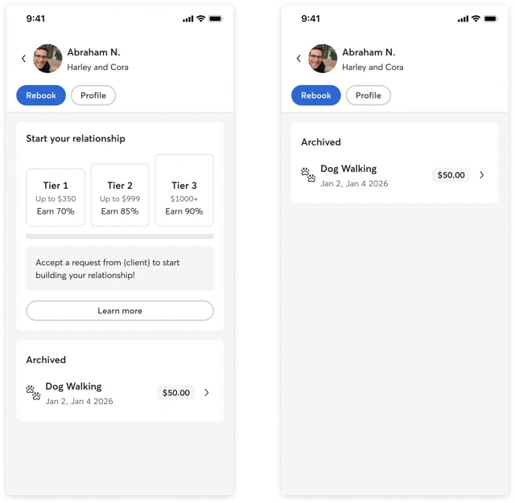
_Progress and no progress_

### **Contacts tab**

* A client only appears in the Contacts tab if they have at least one completed booking (expansion or core). Clients with requests only (no completed bookings) are not shown.
* When a client has core service bookings that contributed to progress, the row displays the number of bookings followed by the dollar amount completed.
* When a client has no progress, either because all bookings are expansion services, or because core bookings were cancelled without a cancellation penalty, only the number of bookings is displayed, with no dollar amount.

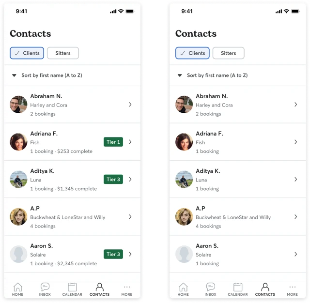
_Today vs proposal_

### **Relationship page with no progress**

* Today, when a relationship has a request that doesn't convert into a booking, the UI shows an empty progress tracker — a bar at zero with tier thresholds visible but no progress made.
* Going forward, the **progress tracker is removed entirely when there is no upcoming or completed progress**. Not all relationships will benefit from tier progression (e.g., expansion-service-only relationships), so showing an empty bar creates a false expectation. The progress tracker only appears once there is upcoming or completed progress to display.

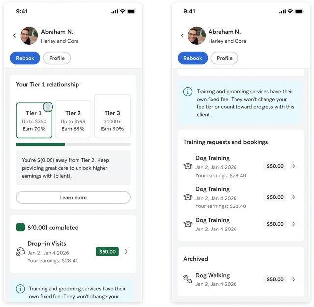
_Mixed relationship page proposal_

### **Mixed relationship page**

* Core bookings follow the standard tier progression with normal color coding and are organized into **upcoming progress** and **completed progress** sections.
* Expansion service bookings (training, grooming) are displayed in their own **expansion services** card. These bookings remain grey and do not contribute to tier advancement, but are clearly presented as active, earning bookings, separate from archived requests.
* **Archived** requests (across all service types, including expansion) are grouped together. Estimated earnings are removed from archived requests to make it clear there was no financial outcome.
* A **contextual callout** informs the provider that expansion service bookings do not count toward their tier progress.

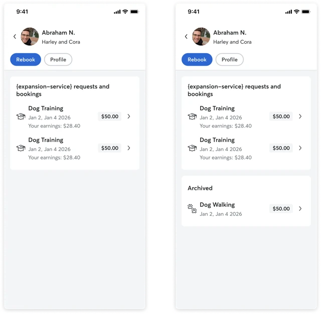
_Training only proposal_

### **Expansion service relationship page**

* For relationships that are expansion-only, the relationship page is stripped of tier progression UI (no progress bar, no tier messaging).
* Below the actions, bookings are organized into two groups:
    * **Expansion services** — a dedicated card for training (and other expansion) bookings, whether upcoming or completed.
    * **Archived** — requests that did not convert into a booking, across all service types.

**Color coding:** grey throughout. Grey signals that none of these bookings count toward graduated take progression.

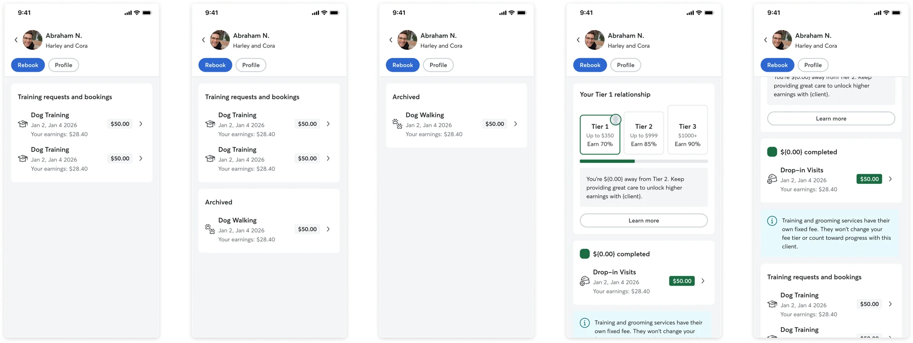
_Split upcoming, completed, expansion services and archived_

### **Disclaimers for training and grooming**

#### Interstitial

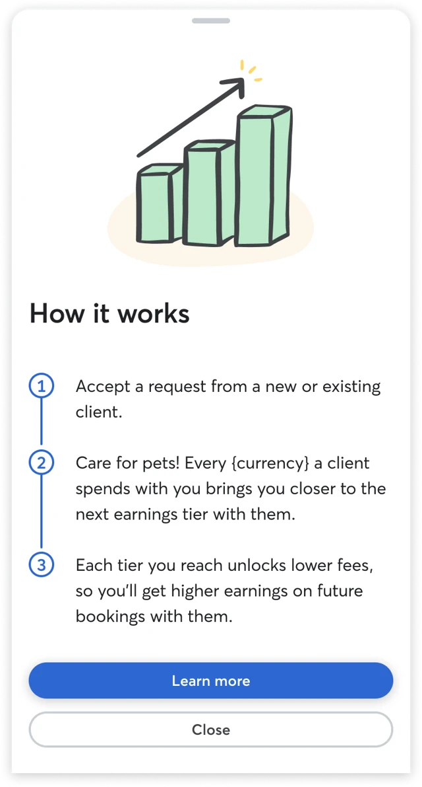

The interstitial is shown during onboarding or a provider's first exposure to the graduated take. It explains the core mechanic in three steps: accept a request, earn progress with every booking, and unlock lower fees at each tier.

Today's copy should be revised to introduce eligible services language for example: _"Every {currency} a client spends on eligible pet care services brings you closer to the next earnings tier with them."_

We may not need to add expansion-specific disclaimers to the interstitial. The screen's purpose is to introduce the concept simply, and listing exclusions here risks diluting the message.

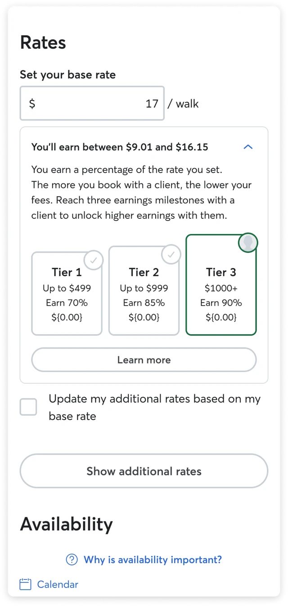
_Currently_

#### Service settings

We don't plan to add fee-related messaging to service settings. This is a task-oriented screen where providers configure their services.

We will, however, need a content review pass across other touchpoints — landing page copy, FAQs, and the mixed relationship page callout — to ensure we consistently reference "eligible services".

#### **Landing page**

1. **Add a dedicated FAQ entry** (should do)

> Do Training and Grooming bookings count toward my progress?  
> _No. Only pet care services like boarding, dog walking, drop-in visits, doggy day care, and house sitting contribute to your relationship tier progress. Training and Grooming bookings do not count toward tier advancement._

2. **Add a qualifier to the "How it works" copy** (must do)

Current text: _"Every dollar a client spends with you brings you closer to the next earnings tier."_

Revised: _"Every dollar a client spends on eligible pet care services brings you closer to the next earnings tier."_

Then add a small footnote: _"Eligible services include boarding, dog walking, drop-in visits, doggy day care, and house sitting. Training and Grooming are not included."_

3. **Update the "Make progress with every dollar" section** (must do)

Add: _"Note: Training and Grooming services are not eligible for tier progress and do not contribute to your client relationship earnings."_

4. **Add a callout/banner component** (could do)

> Which services count?  
> Boarding, dog walking, drop-in visits, doggy day care, and house sitting all count toward your tier progress. Training and Grooming do not contribute to tier advancement at this time.

5. **Update the existing FAQ about multiple services** (must do)

Current: _"All completed services booked by the same client contribute to progress within that relationship."_ — This is actively misleading.

Revised: _"All eligible completed services booked by the same client contribute to progress within that relationship. Eligible services include boarding, dog walking, drop-in visits, doggy day care, and house sitting. Training and Grooming do not count toward tier progress."_

#### Lifecycle

* It would be nice to exclude training-only and grooming-only providers from comms to avoid confusion
* Grooming will only be available in some (not all) of your test markets

## Others

**B. Include Training as-is (same tiers, same thresholds)**

Apply the same graduated structure to Training. Trainers would see the relationship page and tier progression just like core sitters, but most would never progress past Tier 1.

* The 30% Tier 1 fee is higher than today's 20%, which could accelerate trainer churn.
* Trainers would see a progress bar they can never realistically fill — creating frustration rather than motivation.
* Upside: consistency in the product experience and zero additional engineering effort.

**C. Service type sets the relationship expectation (different thresholds)**

Keep the same tier structure (3 tiers, GBV-based) but let each service type define its own GBV thresholds.

| Tier | Core services | Training (example) | Fee |
| --- | --- | --- | --- |
| Tier 1 | $0 – $499 | $0 – $99 | 30% |
| Tier 2 | $500 – $999 | $100 – $249 | 15% |
| Tier 3 | $1,000+ | $250+ | 10% |

Concern: gaming via training bookings. If training thresholds are significantly lower than core services, a sitter who offers both services could book a single training client to quickly unlock lower tiers on that relationship.

**D. Different fee percentages per service type**

Rather than adjusting thresholds, set different fee percentages for Training at each tier.

| Tier | GBV range | Core fee | Training fee (example) |
| --- | --- | --- | --- |
| Tier 1 | $0 – $499 | 30% | 20% |
| Tier 2 | $500 – $999 | 15% | 12% |
| Tier 3 | $1,000+ | 10% | 8% |

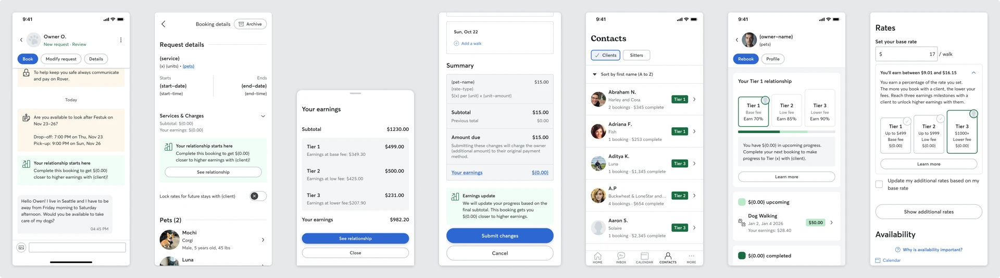
_Base, low and lower fee_

**C+D. Fully service-scoped tiers (independent thresholds and fees per service)**

Each service type has its own thresholds and fee percentages, and tier progression is tracked independently per service within a relationship.

| Tier | Core thresholds | Core fee | Training thresholds (example) | Training fee (example) |
| --- | --- | --- | --- | --- |
| Tier 1 | $0 – $499 | 30% | $0 – $99 | 20% |
| Tier 2 | $500 – $999 | 15% | $100 – $249 | 12% |
| Tier 3 | $1,000+ | 10% | $250+ | 8% |

* Eliminates the gaming concern: booking a training session doesn't advance a sitter's core service tier.
* Trainers get thresholds and fees that reflect their economics.
* The 3% overlap case is cleanly resolved.
* Highest complexity.

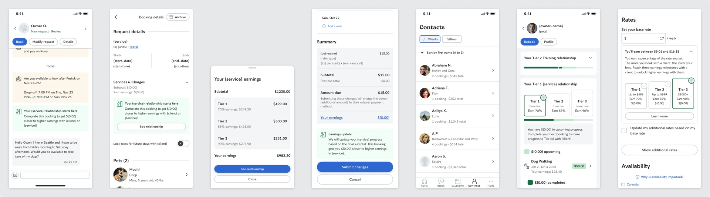
_Progress on a service basis_

**E. Move to a points-based system**

Replace raw GBV with a points system where different service types earn points at different rates. A training session might earn more points per dollar of GBV than a boarding night, normalizing progression across service types.

* This is the most structurally elegant solution.
* Points can be tuned per service to reflect different economics (e.g., 2x points per GBV dollar for Training).
* Major UX and messaging overhaul required.
* Significant engineering investment.
* Adds cognitive complexity — GBV is already difficult for sitters to understand. Points add another abstraction.

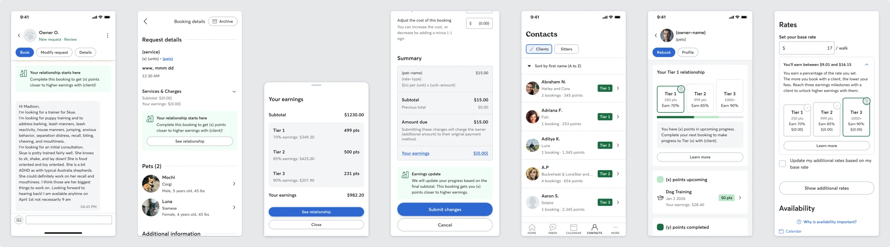
_Point based system_
