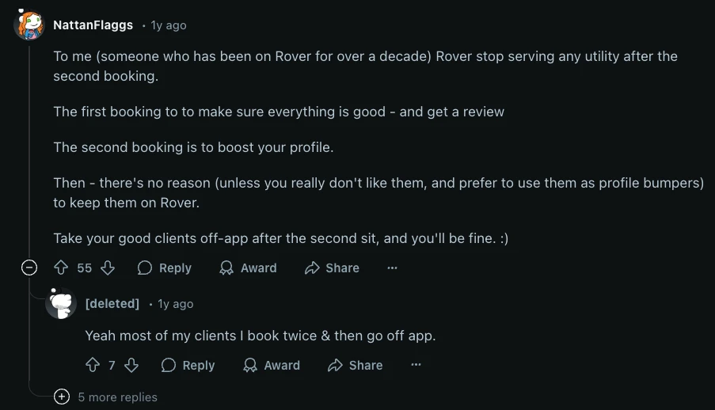
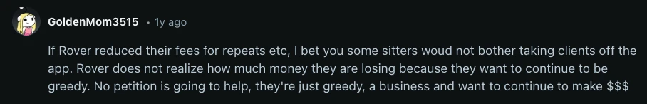
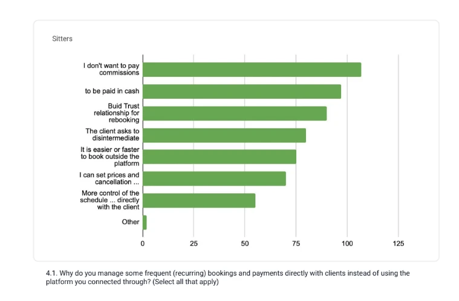

# 1P: Reduce sitter-side fees - UK and ES 5% test

**URL:** https://roverdotcom.atlassian.net/wiki/spaces/PSD/pages/4524113922  
**Author:** Josh Harris | **Last modified:** Dec 02, 2025

---

# Summary

* **Goal:** Learn whether reducing one of the financial incentives to divert encourages sitters to book more on platform, and by how much
* **Problem:** Rover takes 20% of sitter earnings from each booking (15% in Europe). Sitters tell us all the time that they think this is too high, and that they wouldn't divert if the fee was lower.
* **Solution:** Reduce the sitter fee to 5% (for certain services, in certain countries)

    * 5% sitter fee for all recurring service bookings (Walking, Drop-ins, Daycare) in the UK
    * 5% sitter fee for all Walking bookings in Spain

* **Roll-out plan:** Country-level test, run in the UK and Spain
* **Results:** TBD

# Resources

* Documentation

    * Original proposal: https://docs.google.com/document/d/1sLGab-FNitoCxRRASiKYFG08CWJTm5Td3sUmAkyrWrc/edit?tab=t.0
    * https://roverdotcom.atlassian.net/wiki/spaces/PSD/pages/4597809177
    * Experiment plans

        * UK: https://roverdotcom.atlassian.net/wiki/spaces/RTEST/pages/4448682600
        * Spain: tbc

    * https://roverdotcom.atlassian.net/wiki/spaces/CRM/pages/4577460245

        * Creative brief: https://docs.google.com/document/d/1wFx5x5HkD9QtLqiCmdIXVL6OomUiq1SGx5RnPV6Rb0U/edit?tab=t.0

    * Ops ticket: https://roverdotcom.atlassian.net/browse/OPS-8296

# Opportunity - Why?

### Goal

The Sitter Experience team's objective is to increase owner LTV by improving sitters' experience and satisfaction with Rover. One of the main pain points for sitters is the Rover fee.

Our goal is to get a data point that helps us understand the extent to which the sitter fees are driving diversion. We acknowledge that it's unlikely a substantially lower sitter fee percentage results in overall higher LTVs and therefore there's a strong possibility we end up rolling this back, but believe the value of getting the data point is worth the short term financial risk.

### Problem statement

Rover takes 20% of sitter earnings from each booking (15% in Europe). The fee amount is the same regardless of how many bookings you've done on the platform, or how long you've cared for a particular client's pets.

Over time sitters feel like they're getting less and less value from Rover whilst still paying a consistently high price. This is particularly true in 'repeat relationship' bookings where the owner and sitter know and trust each other, but many sitters feel the same even about 'new relationship' bookings.

We have substantial evidence that frustration around the Rover fee leads sitters to divert (either by instigating the diversion or by not resisting when instigated by the owner).

### Customer Feedback

### Hypothesis

**Based on** feedback from sitters

**We believe that** by decreasing the sitter fee to 5% (for certain service types)

**We will** make it more cost effective for sitters to keep relationships on platform for longer

**We'll will be successful if** the average relationship duration on Rover increases (metric tbc)

# Solution space

## High level product trade-off

* **Financial risk:** Decreasing the sitter fee is a huge risk. Whilst we believe there are many sitters that divert because of the fee, there are also many that keep their bookings on platform and happily pay the 20% price. By reducing the fee we will get more sitters to book on platform who otherwise would not have (which is all incremental), but we'll also lose the revenue from the sitters that would have booked on platform anyway at 20%, and are now booking at 5%. Because of the huge financial risk, we need to take a potentially more conservative approach than might otherwise seem optimal
* **Sitter sentiment risk**: Fees are an (understandably) incredibly sensitive topic for sitters. There is so much attention and raw emotion related to sitter fees in the various social communities, so we have to be very careful about not causing what feels like 'unfair' scenarios where lots of sitters are frustrated about being 'disadvantaged' relative to other sitters in terms of fees.

### Proposed solution

There are endless permutations of possible fee structures, so we chose some constraints to narrow our focus. Those constraints are:

1. Be sure we have an impact! We don't want to undercook the test and be left wondering what could have been
2. Make sure we learn something that opens a path to testing in the US
3. Minimise revenue at risk whilst still getting statistically significant answers
4. Value "easily understood by sitters" over "most financially optimal on paper"
5. Run at a country level. Fees are such a sensitive topic that we want to avoid blowing up sitter frustration until we have higher confidence it's worth it

Given those constraints, we have come up with **two test proposals we intend to run in parallel**:

1. **5% sitter take rate for all recurring service bookings in the UK**
2. **5% sitter take rate for all walking bookings in Spain**

Running these two tests in parallel for 6 months would put an estimated maximum of $85k of take at risk in a 6 month period. This really is a worst-case scenario, which assumes there is zero positive impact on the number of units.

In the event of a "roll back" to the previous fee structure, we intend to keep existing sitters in the experiment "legacy'd" to the 5% take rate for up to 2 further years to avoid undermining sitter confidence in Rover as a reliable partner. We estimate this puts a further $90k at risk (ie a total of $175k over 2.5 years), again assuming there is absolutely zero positive impact on incremental units.

We have evidence that diversion is substantially more prevalent in daytime services than overnight, meaning that the financial opportunity here is the greatest. The fact that the service is high frequency also means we should be able to see any positive impact in a shorter space of time, which - coupled with the lower ABVs of the service - means the financial risk of these tests is also less.

**Test 1: Recurring, no milestone, UK, 5%**

* We believe that the biggest diversion opportunity is in recurring services, where we estimate roughly 60%+ of relationship units happen off-platform in the first year
* Recurring relationships drive higher LTVs than one-time relationships, so incentivising sitters to switch potential clients to recurring could be a powerful additional way for this test to win
* We considered adding a milestone (e.g. first 2 weeks are at higher rate, then drops to lower rate) but it doesn't meaningfully change the financial risk, and could dilute the impact on units
* This test does significantly overlap with the 'all walking bookings' test we're proposing in Spain (where all recurring walks will also be included), but creating a recurring-only test limited the financial risk enough that we could run something in the UK without breaking our revenue risk cap. We think running in the UK is important because the learnings are more likely to be applicable to North America due to being a more mature market (as well as possible cultural similarities)

**Test 2: All walks, no milestone, 5%, Spain**

* This is the broadest test proposal which has the highest chance of uncovering how much diversion is driven by the sitter fee structure.
* By including both recurring and one-off services, this test could help us better understand the substitution effects between these two booking types than in a UK recurring only test
* Given the low overall volume of walks in Spain, we would only be putting $12k of take at risk, and so felt confident about going for a more ambitious model

More information and justification: https://docs.google.com/document/d/1sLGab-FNitoCxRRASiKYFG08CWJTm5Td3sUmAkyrWrc/edit?usp=sharing

### Other solutions considered

* Aside from other permutations of the same tests (eg different take rates, countries, number of units to qualify, etc) we have also discussed:

    * Testing on all services, not just walking

        * Running this test would put more potential lost take at risk than I believe we would tolerate. E.g. running the same test in Spain but for all services (5% fee, no milestone) would put $180k in take at risk in a 6 month period

    * Cash payouts on hitting certain milestones

        * We are assessing the sitter reaction to cash payouts vs fee reductions via user research, but my expectation is that cash payouts are likely to be less impactful
        * We calculate that we could afford to pay out roughly $1 per walk, and offering "do 10 walks this month and get $10" didn't feel to me like a strong enough incentive

    * "Pay up front"/bundled discounts

        * We are still interested in this option, but I consider it something that can be explored in parallel and/or as an iteration to our current tests, and that our current tests are likely on the critical path to launching a bundle
        * Bundles would likely involve a sitter side fee reduction on units delivered as part of a bundle; and an owner side per-unit rate discount offered by the sitter (eg 10% discount for buying a bundle). As part of our tests we'll understand the incentivising effect of the reduced sitter fee.

### Risks and mitigations

**Sitter awareness and understanding**

* Sitters don't know the fee has changed

    * Mitigation: lean very strongly into over-communication

* They know it's changed but don't believe it's permanent

    * Mitigation: do not communicate it as a temporary test

* They are confused about which services the new fee applies to and/or are suspicious about why it only applies to certain services

    * Mitigation: ???

* New sitters might not think 5% is "low" because they didn't know it was ever 15%. So we might lose value from the experiment because it doesn't reflect the 'ongoing relationship' problem

**Notes**

* If we see this going negatively early on, what is our plan? We need to have this clear (Also has an implication for how we do the IP)

    * What are some of the ways this could go wrong?

        * **Comms** => too conservative, risks that sitters don't know we have made the change. We know sitters have been wanting it for a long time, so we could do a 'big bang' launch. Risk is that it could create non-normal behaviour and so is not a reliable datapoint.

            * Could we have sitters 'opt in'? This would help us be sure that sitters 'know' the fee has changed

        * Sitters don't know the fee was ever 15%
        * Could we communicate this as a "you've earned the 5% fee" with the implication that you could "lose" this status. Would help give us a way back if this is a fail.

            * We could parallelise this test with qual studies to understand how people think about these kind of 'earning' programs.

        * We could test some different comms strategies for the launch and see the different behaviours
        * **Financial**

            * We could lose more than we expect if by doing this we realise that the fee is 15% for the other services. We should get a read on this from Liz's research

    

* People switching from one-time to recurring and vice versa. What happens to the fees there?
* Plan to update all of the legacy fees to 20%/15% => perception that we are not consistent and unreliable

## Roll-out and communications plan

* See lifecycle strategy: https://roverdotcom.atlassian.net/wiki/spaces/CRM/pages/4577460245

### Timeline

* **Tuesday Apr. 29th**: silently release the fee change **for recurring relationships only** in both ES and GB

    * For existing recurring relationships nothing will happen at that point from a customer perspective
    * Only new recurring relationships will see the new fee applied right away, however provider payout happens the next Tuesday and so it's unlikely the new fee gets noticed before Tuesday May, 6th.

* **Friday May 2nd:** Teaser
* **Tuesday May 6th:** silently release the fee change for one-time services (only applies to walking in ES)

    * New fee immediately applies to new bookings

* **Monday May 12th:** existing recurring relationships cycle with the new fee
* **Tuesday May 13th:** Email + In-product announcement

## Results

https://roverdotcom.atlassian.net/wiki/spaces/MARKET/blog/2025/09/18/5096604080/Sitter+Commissions+Iterations+Investigation#Sitter-Decile-UK%2FES-Commissions-Test-Analysis

**TLDR**

* **GB overall:** +1.7% \[-13.7%, +16.9%\] → neutral result
* **ES overall:** -2.6% \[-30.1%, +24.0%\] → neutral result
* **GB Decile 1 (top earners):** +14.4% \[-5.7%, +34.3%\] → non-statsig, could trend statsig positive with more time
* **GB Daycare:** +16.9% \[+1.0%, +32.1%\] → statsig positive; unclear why

**Reminder on Impact Calculation Method**

* **GB:**

    * _(% YoY Recurring Units Post Period – % YoY Recurring Units Pre Period) – (% YoY Overnight Units Post Period – % YoY Overnight Units Pre Period)_

* **ES:**

    * _(% YoY Dog Walking Units Post Period – % YoY Dog Walking Units Pre Period) – (% YoY Other Units Post Period – % YoY Other Units Pre Period)_

**Sitter Commissions Experiment – Update**
~4.5 months after experiment start: **~51k units in GB** and **~10k units in ES**.

**Overall impact so far:**

* **GB:** **+1.7%** \[-13.7%, +16.9%\]
* **ES:** **-2.6%** \[-30.1%, +24.0%\]

**GB Performance Breakdown**
Overall **+1.7%** \[-13.7%, +16.9%\] in GB, driven by service-level differences:

* **Dog Walking:** **-9.5%** \[-25.7%, +6.4%\] (61% of experiment units)
* **Daycare:** **+16.9%** \[+1.0%, +32.1%\] (21% of experiment units)
* **Drop-In:** **+10.5%** \[-8.0%, +29.1%\] (18% of experiment units)

**New Sitters in GB**
_(Joined after experiment started – 13% of total experiment volume)_

* Overall: **+21.4%**\[-30.1%, +78.6%\]

**Deciles in GB**
_Note: Deciles are calculated per year for all service types based on the total amount of money sitters earn in the Platform._

* Decile 1 (highest earners in Platform): **+14.4%** \[-5.7%, +34.3%\] (58% of experiment units)
* Decile 2: **-4.8%** \[-24.4%, +13.8%\] (16% of experiment units)
* Decile 3: **-4.6%** \[-26.2%, +16.3%\] (9% of experiment units)
* Decile 4: +**4.2%** \[-21.5%, +30.5%\] (6% of experiment units)
* Decile 5: **+9.1%** \[-20.2%, +38.6%\] (5% of experiment units)
* Deciles 6 to 10: **-38.1%** \[-74.7%, -1.8%\] (6% of experiment units)

_**Next Steps**_

* We want to have more precision on the deciles provider results, especially for decile 1 (having it by service type, checking relationship lengths and using Canada as control market).
* We also would like to gain a better understanding of the recurring adoption story. Since Recurring was introduced in late 2023, the test results might actually be slightly more positive than shown above, as the year-over-year comparison for the pre-period could be artificially inflated due to Recurring adoption in the market.
* Deep-dive to find clear narrative on the difference across service types for GB.

### Awareness survey results

#### **Executive summary**

https://roverdotcom.atlassian.net/wiki/spaces/DSN/pages/4951639504

* Most sitters are aware that Rover charges a service fee, but fewer understand the exact percentage being deducted from their earnings.
* Awareness of the recent fee change is generally high in both the UK and Spain, with the UK showing stronger recognition. However, clarity around the specific discounted amount remains inconsistent.
* Sitters who had recently received booking requests showed higher awareness and understanding of the fee change compared to those who only updated their calendars. Active engagement with the platform appears to drive better comprehension.
* Email was the most used channel, but many sitters who saw it didn't fully understand the change. In contrast, those who saw the message in the app were more likely to understand it correctly, showing that in-app messages may be more effective.

## Rollback plans

* After 7 months of test the Spanish experiment didn't show any positive results (potentially due to low sample size and noise). As a result, the International team would like to shut it down.
* There are two rollback options: rollback the test for all sitters or only for new sitters that would sign up after the rollback date.

### Timeline

* 12/15/2025 - We will stop assigning new sitters going through SSU to the test group such that they will experience the flat 15% fee for all service types.
* 1/29/2026 - We will communicate to existing sitters in Spain that their Dog Walking fee will change back to 15%.
* February (exact date TBC) - We will turn off the test for existing sitters in Spain and migrate them back to the flat 15% fee for all service types experience

#### Cat in a flat implications and timeline

* Cat in a flat providers that are migrated over to Rover will be migrated to the flat 15% fee for all service types.

    * On 1/20/2026 they'll receive a heads up about the upcoming migration together with a FAQ. The FAQ will mention the 15% flat fee for all service types.
    * On 2/20/2026 Cat in a flat providers will be migrated to Rover with a 15% flat fee

|  | **New sitters only** | **All sitters** | **Considerations** |
| --- | --- | --- | --- |
| Sitter experience | 1 feature flag to turn off - trivial | 4 feature flags to turn off, 1 code change, 1 provider group migration, 1 eng. for a week | Only new booking requests would be impacted. Existing requests would retain the lower fee |
| Lifecycle | Disable banners in transactional emails for all sitters in Spain | At least one email some time before the change to let them know | Comms freeze from Dec 22nd through Jan 9th. EOY is not a good time for comms |
| CX | Update internal and external documentation - small | Update internal and external documentation - small | Potential CX contact increase due to increase in fees. EOY is peak period for CX, recommendation to avoid initiative with high contact risk |

## Decision log

* We are rolling back the Spanish test for New sitters only on 12/15/2025 as it's an easy lift. We are targeting Feb. to roll back the test for existing sitters since it requires some eng. lift and lifecycle communications.
