# Deep-dive: account-based

**URL:** https://roverdotcom.atlassian.net/wiki/spaces/PSD/pages/5215357278  
**Author:** Bernardo Prudêncio | **Last modified:** Oct 31, 2025

---

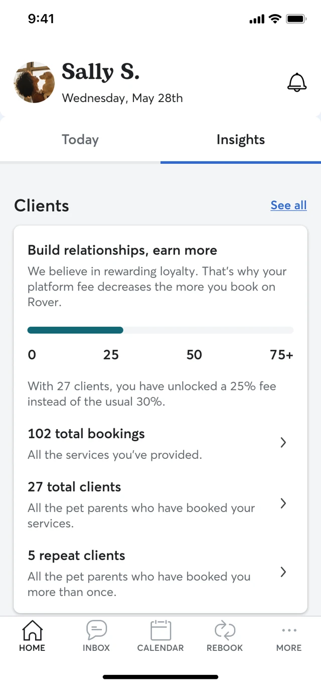
_Total clients mock-up_

A take rate model that decreases solely with tenure, such as lowering fees over time or after a certain number of bookings, rewards sitters for staying active on the platform. However, this approach doesn't address diversion: sitters could use Rover mainly to acquire new clients, then move bookings off-platform as their costs drop, offering little added value to Rover.

For this reason, **tenure-based incentives should be combined with relationship or behavioral criteria to better align incentives, encourage loyalty, and reduce diversion risk.**

See example from Preply: https://help.preply.com/en/articles/4171383-preply-commission-model

### Recency criteria

We can add a recency layer to the model. While this risks driving users off-platform, it could prevent gaming. We would consider a recency signal, such as a number of bookings within the last year. This could encourage repeat platform behavior, allowing users to maintain the metric and a lower rate.

When layering recency, we can ensure bookings, unit or GBV happens within a specific timeframe. This relates to tenure, as we may not want sitters who only work summers to receive benefits like lower take rates.

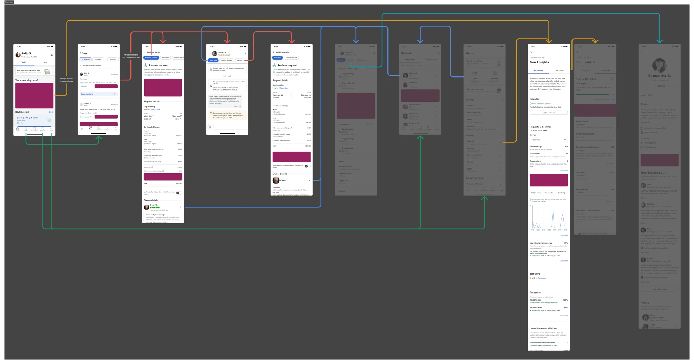
_Tenure touchpoints_

#### Deep diving in GBV as a criteria

We will use GBV milestones across relationships. On the analytics side, we will consider 5+ milestones and use both completed bookings and cancellation penalties in the relationship GBV.

**GBV as the threshold, not completed bookings.**

Spreadsheet explorations:
- https://docs.google.com/spreadsheets/d/1sOLCqttWzfx2PZLOb_K6Fq7k0JRTi1IOWTUU00DpunU/edit?gid=1984665252#gid=1984665252
- https://docs.google.com/spreadsheets/d/1_GAXNcLTV3XSpf10yajPdbF3yWj_R2sijEiGN-cvu-g/edit?gid=1984665252#gid=1984665252

#### Tracking GBV

**Sitters can only see their yearly earnings on the payment history page.** However, this is hard to find due to confusing entry points and multiple steps. The information is basic, showing only total earnings per year without totals or options to view different date ranges.

To help sitters track GBV, we should add this to prominent places like dashboards or include it in the payment history so they understand their current status. We should also show how each completed booking contributes to their progress, using touchpoints like inbox, conversation, or booking details.

**Actual GBV as a threshold**, and not completed bookings might make it fairer when dealing with booking happening at the same time or when dealing with cancellations.

Mockups:

**Home**
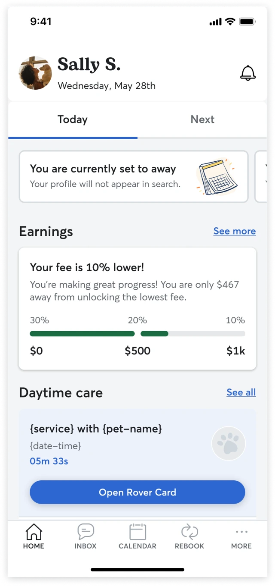

**Conversation**
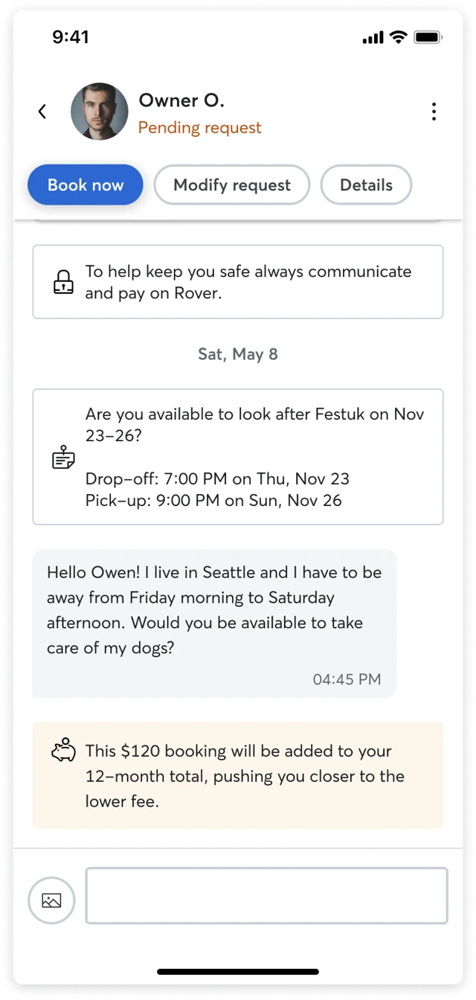

**Booking details**
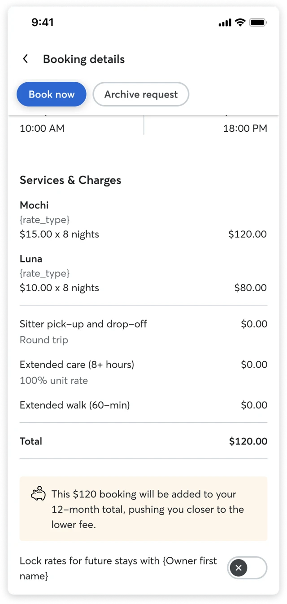

**Payment history**
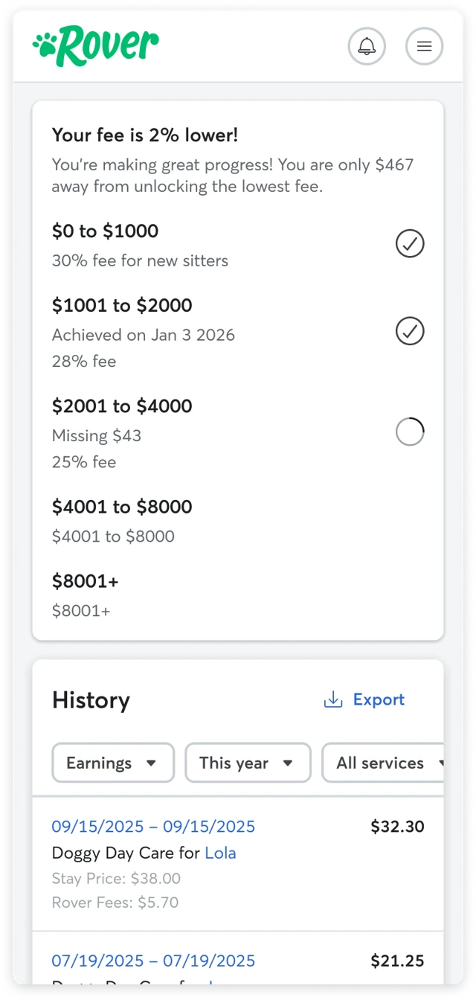

#### 1 vs multiple milestones

The numbers of milestones impacts the feel of the system, trading simplicity for sustained motivation. A **single** milestone creates a binary state where they are either at a standard rate or a lower rate, making the goal easy to understand. The primary advantage is a low cognitive load.

Having two or three milestones create a journey for the sitter, which makes them feel like they are progressing and growing their business on the platform. This provides long-term motivation because each new milestone feels like an achievement. This required a more dedicated UI to track their progress effectively, and the value jump between each milestone must be significant enough to be meaningful.

Using **five or more milestones** create a constant sense of progress, making rewards feel immediate and frequent. **This gamified approach can be highly engaging because it reinforces the desired behavior on a lot of transactions**. We should avoid having too many milestones as the required progress for each small step might be too small to feel impactful, potentially devaluing the sense of achievement.

Mockups:

**One milestone**

**Two milestones**
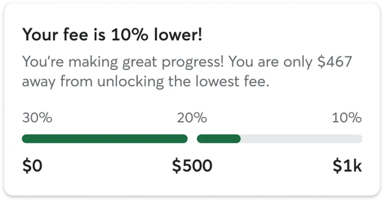

**Five milestones**
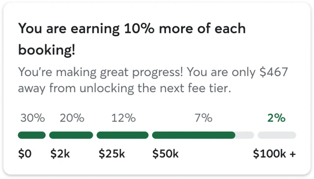

Open questions:
- Do sitters keep bookings on platform to progress faster or divert until they have reached the milestone?
- What is the impact of entrance fees on this model? Activation? Matriculation?

#### Time-based recency criteria

We briefly discussed adding a recency layer to prevent sitters from taking new customers on the platform and then diverting them. With this layer, sitters will see the benefit of keeping customers on the platform, so transactions count towards lower rates with newer customers.

Combining **two or more milestones** with a recency layer can increase the complexity by a lot by asking sitters to manage progress and maintenance. Having **one milestone** should be manageable, and allows us to play around with the concept of grace period (e.g:. reach out $2k within 3 months to get a lower fee for the following 3 months).

With this, the system is no longer a "fill-the-bar" experience. **A sitter needs to track how much GBV they need to the next milestone and how much is expiring soon dropping them to a lower tier.** A progress bar can go backwards and this can be confusing if not communicated with extreme clarity. This also introduces loss aversion by making them work to prevent losing the status they got.

Because of this complexity, we can't rely on simple, contextual touchpoints alone. We need to creating a single "source of truth" dashboard — **earnings dashboard.**

Mockups (one milestone, two milestone, five milestones — Safe / Risk / Recover / Goal states):
**One milestone: Safe / Risk / Recover**
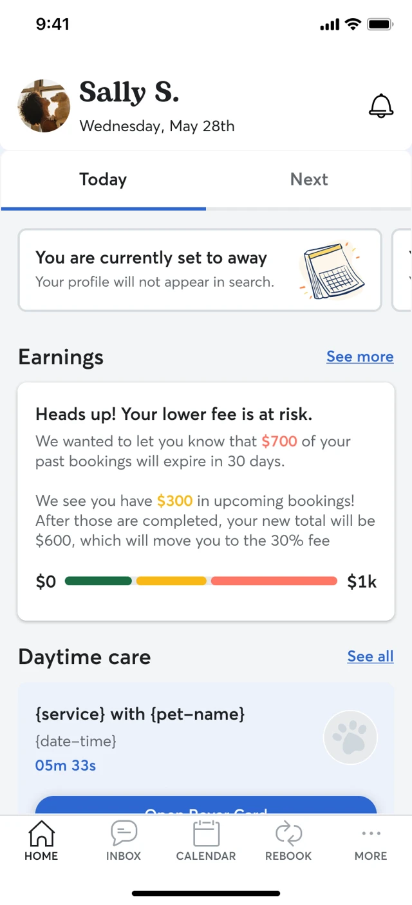

**Two milestone: Safe / Risk**
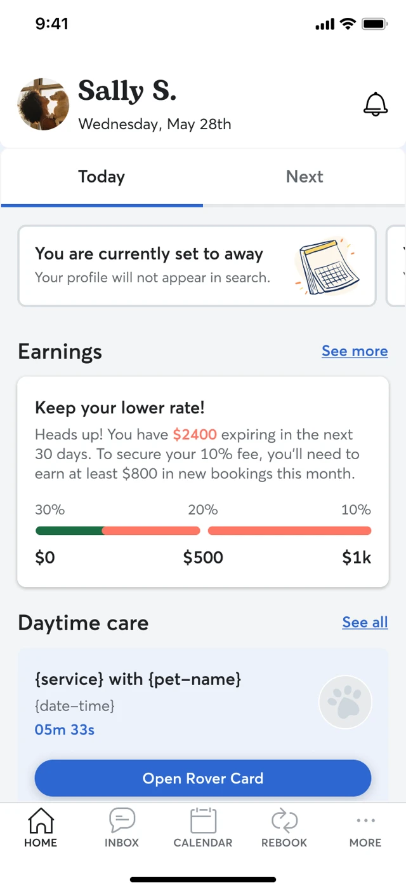

**Five milestones: Safe / Risk / Recover / Goal**
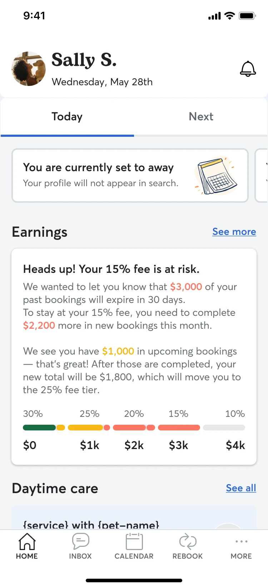

> **Warning:** "Cliff effect": If a sitter had a massive, single booking ($$$) at the start of the period, their progress can dramatically drop overnight. This feels like punishment for something so normal.

**Activity-based recency criteria:** We could consider other criteria such as activity threshold (e.g: minimum of 10 bookings in 6 months) or rolling bookings (e.g:. every 100 bookings), but sitters can easily game this system. Once they achieve a lower take, they only need to ensure some bookings on platform or valuable enough bookings on platform to keep the lower rate.

#### Rolling basis

Fairer to the user, as no single day causes a catastrophic loss of status. However, it's much harder to communicate and for a user to mentally track.

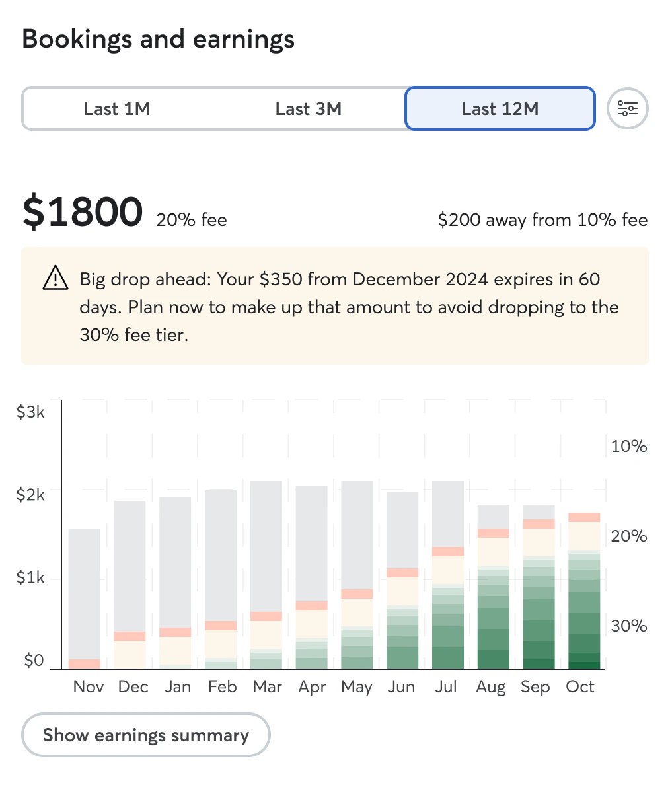
_Rolling basis_

#### Gradual decay

Instead of a booking's full value expiring all at once a year later, the sitter's total earnings progress would be "taxed" a small, fixed amount every day (e.g:. they lose $2 progress daily). **The loss aversion here is extreme.**

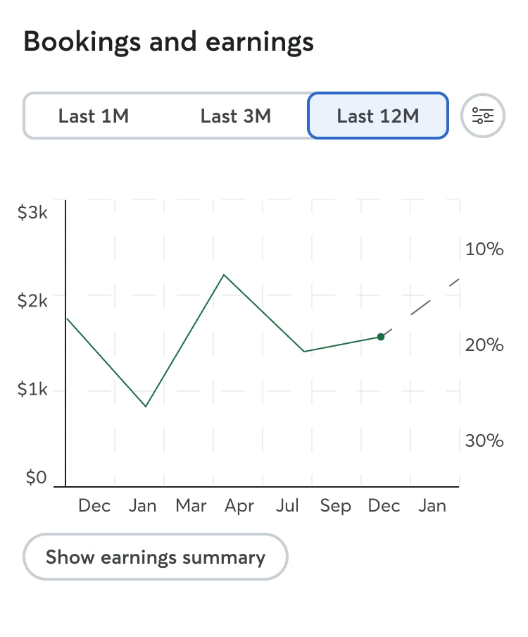
_Gradual decay_

> **Info:** Visibility of status: this principle states that the system should always keep the user informed about what is going on through appropriate and timely feedback. The entire concept of tracking GBV requires making an invisible system metric visible to the sitter.

#### Grace period

To keep sitters engaged with our recency requirement, we must manage how earnings "cliffs" are handled. A daily or quarterly drop is a poor user experience, either too chaotic or too punitive.

One approach is the **"monthly rolling" model**. In this system, the sitter is on maintenance mode. On the first of each month, we would notify them of the GBV from the same month last year that is set to expire. This reframes the entire month into a 30 day mission to _replace_ that expiring amount. This keeps sitters constantly active but can also be a source of continuous stress.

However, we can explore an alternative: a **"status" model**. This would work like a true grace period. In this model, when a sitter first hits the threshold, they don't just get the lower fee, they **achieve a status** for a guaranteed period, for example, the next 12 months. During this "grace period," their 10% fee is safe, even if their rolling GBV dips. This removes the monthly stress and allows them to truly enjoy their reward.

The system would keep checking daily their GBV from the _previous_ 12 months to see if they re-qualify for the next 12 months, resetting when they do.

**This shifts the model from a maintenance mode to an earnings mode.**

Mockups:
**Monthly tiers**

**Yearly tiers**
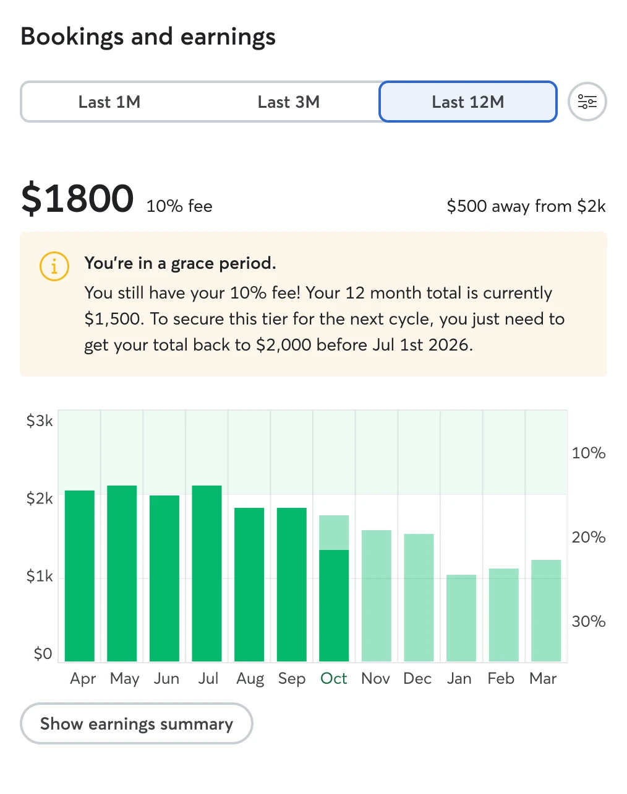

**Quarterly tiers / last year and this year**
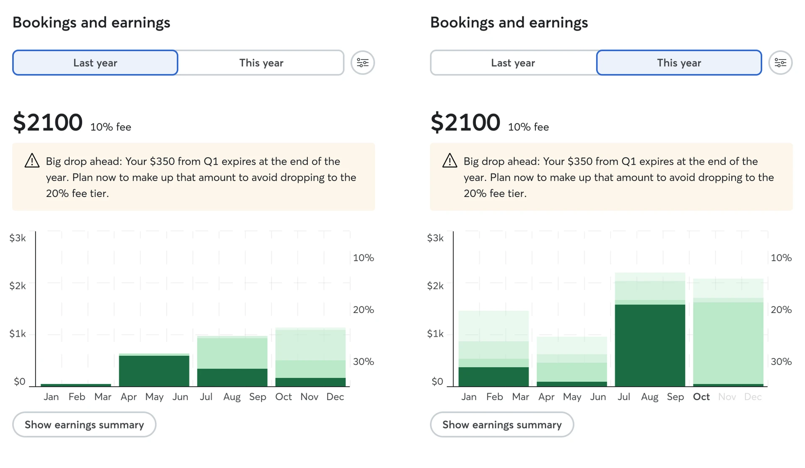

> **Warning:** "Running in place": Sitters that reach a higher milestone might feel they are just "running in place" as they have to maintain a high level of GBV _forever_ just to keep the status they already earned. This can lead to burnout or frustration.

#### Gaming the system

This is a possibility. A sitter can ask someone to have a booking to retain a lower fee, but there's a couple things we would have to consider here:

* A booking needs to be completed;
* The sitter can return the money, or even ask a family member to do the booking but values will be high, there's owner side fee and possible taxes.

#### Airlines miles and credit card points

An airline program is a high-agency, flexible-reward "game" that users actively _play_. Our system is a passive, fixed-reward "benefit" that users _receive_.

Because of this, we can't just use their mechanics, but we can try and learn from their psychological levers and communication strategies.

* **Reward vs. discount:** They offer a tangible reward. We offer an _invisible_ discount (a smaller fee, we can't put absolute value on). A reward is exciting; a discount is less bad.
* **Active agency vs. passive earning:** They give users active choice ("I'll use my airline card for this purchase"). Our sitters don't "choose" to earn; it just happens when they complete a booking.
* **Flexible spending vs. fixed benefit:** They let users choose how to spend points (flights, hotels, magazines). Our benefit is fixed and automatic.

Because we lack the "fun" of agency and flexible rewards, we must work twice as hard to make our system clear and motivating.

**Airlines treat point expiration differently from status expiration.**

* **Soft expiration of points:** Seems the most common one. Points never expire as long as you have qualifying activity within a 12 or 18 month period. If you go idle, you lose points. _This might not be applicable in our model due to how easy it is to game._
* **Status expiration:** Status seems based on a rolling 12 month period. You need to earn a certain amount of miles within the period to earn or re-qualify for the tier. _It seems they do it from start to end of year._

Here's what we can apply from airline programs:

* **Make the invisible, visible:** They are good at making abstract numbers (miles) feel tangible. We have to do the same for our "savings".
* **Aspirational goals:** It's not just about the miles, but the status itself (Silver, Gold, Platinum). People go the extra mile to keep the status.
* **One clear action:** We need to make the core rule extremely simple. Instead of "fly with us, earn more" or "spend on this card, earn points", we need to lean heavily on "complete booking, reach new tiers".

This system benefit the busiest sitters. We shouldn't hide this, we should frame it as a path available to everyone. Airlines programs are for **frequent flyers,** we can reward loyalty and professionalism.

#### Relationship layer

Given the complexity recency criteria adds to the model and that the model alone might not drive the desired behavior without heavy gamification, we can incorporate the relationship aspect by valuing repeats more.

We can either count only repeat bookings toward progress or apply a multiplier based on repeat count (e.g. 1$ equals 1 point for new bookings, 1$ equals 2 points for second bookings, etc.)

Mockups:
**Only repeats count**
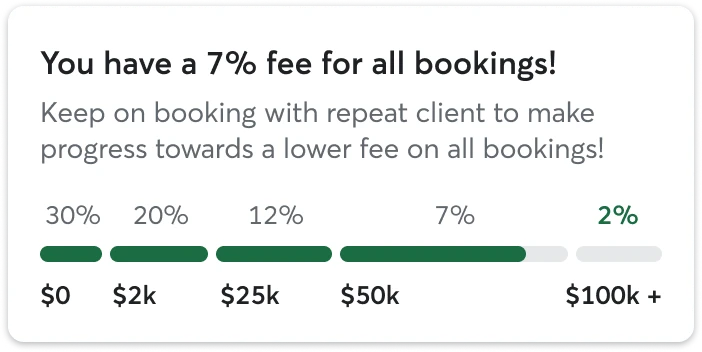

**Repeat multiplier**
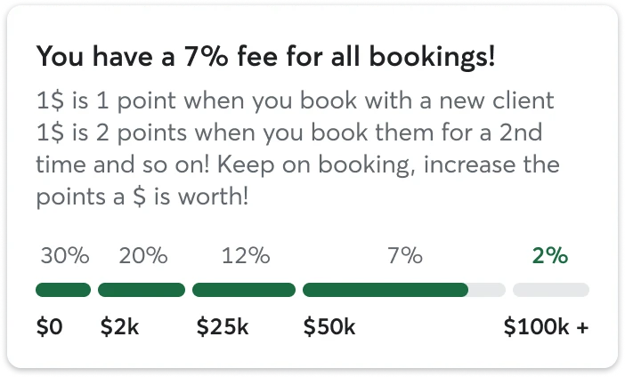

#### Touchpoints

The strategy here shifts from individual relationships to overall journey and progress. We can still explore two main communication concepts.

There's a **general and foundational communication**, which allows us to tell sitters how the new take rate works. This can be a simple announcement or **compact view** of progress, or introduce a place where sitters can track their global progress, an **extended view**, that acts as the "source of truth". This is where they could see their detailed GBV calculations, recency layer and complete progress history.

Then, there's **transactional and contextual communication** focused on the impact of each booking on the sitter's general take. The goal here is to connect every request/booking to their long-term progress. We likely only need a compact view as they should only provide a simple, contextual callout that clearly connects their immediate action to their long-term progress.

Mockups:
**Compact**
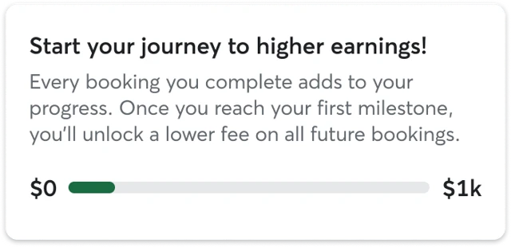

**Extended**

**Transactional**
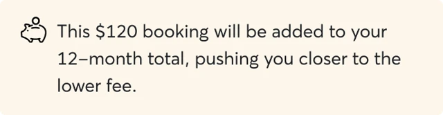

#### Transparency

Same as relationship-based

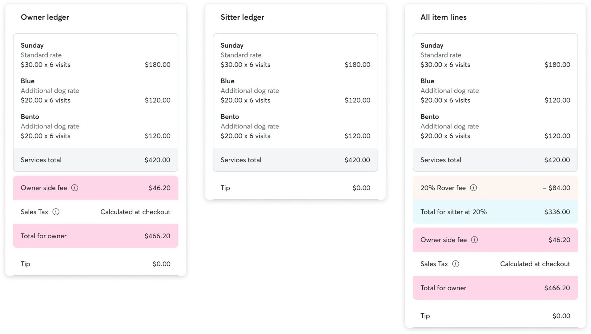
_Transparency_

#### Threshold-crossing bookings

A scenario we might have to design for is the moment a sitter's booking crosses a GBV threshold. How we handle the fee for these bookings have a significant impact on fairness, revenue, and our ability to drive retention. There's two approaches we can take on an experience level:

* **Splitting the fee** proportionally create the most transparent and fair model. The sitter receive the benefit the instant they earn it. However, this created a "blended fee" for a single booking that can be difficult to display clearly on a ledger or invoice, confusing sitters.
* We can **credit or cashback** on future bookings based on the "overpayment", having the entire booking charged at the current, higher fee. The sitter would have a tangible credit that they can redeem by completing another booking on our platform. However, this can feel unfair due to its delayed gratification nature. There's probably added complexity of keeping a credit wallet for every sitter.

When we consider an account level model, a sitter would only have as many booking that cross the threshold as milestone - unless there's a recency criteria. This makes the cashback a rare event. On a **relationship level**, a sitter will cross these milestones over and over again with every client. This makes cashback a recurring, repeatable incentive loop.

Mockups:
**With and without splitting booking**

**Cash back on next booking**

> **Info:** Recognition rather than recall: this principle advises minimizing the user's memory load by making things visible. A user should not have to remember information from one part of the interface to another.

#### Communication

We must provide the right info as sitters' statuses change. Key scenarios and messaging:

**Awareness (general comms)**

* All sitters in the test market get a one-time message about the new model.
* Sitters meeting milestones on day 1 are told their advanced status.
* Clarify that GBV includes completed bookings and paid cancellation fees, excluding tips.
* All bookings count towards GBV but past fees aren't refunded.

**The request loop**

* Request unlocks tier: This booking unlocks 20%/5% fee tier after completion.
* Request at higher rate: 30% fee applies. You've earned $500 of $1000. Keep going to unlock 20%!

**The modification use case** _(inform sitters of changes, mainly owner changes)_

* Unlocked tier lost: This request no longer unlocks 20%/5% tier; you'll have earned $500 of $1000 upon completion.
* Unlocked tier gained: This request now unlocks 20%/5% tier as you passed $1000 threshold upon completion.

**Post booking updates** _(immediate feedback on status changes)_

* Update status at completion or penalty processing.
* Achievement: Congrats! You unlocked 20% fee, keeping more from future bookings.
* Cancellation: Booking cancelled, but penalty counts toward unlocking 20% tier.
* Cancelled request update: This request was cancelled and won't count toward GBV progress.

**Recency update** _(when bookings no longer count)_

* Status at risk: You have $100 from last year that will expire from your 12 month total in 5 days. To secure your lower take rate, you'll need to earn at least $101 in new bookings before {date}.
* Status lost: Your take rate has been updated to 30%. This is because some older bookings have expired from your 12 month total.
* Status secured: Your lower take rate is now secured for the next 7 days.
* Booking expired: A booking from a year ago has expired from your 12 month total. Your current GBV is now $5674.

#### High-level flow

[Embedded Figma: https://www.figma.com/design/m3qiV0B3gQ2LABv0jyVgy3/-UX2-6175--Graduated-take-rate?node-id=358-25082&t=Ap1ZkbJ7gFjQyTur-4]
