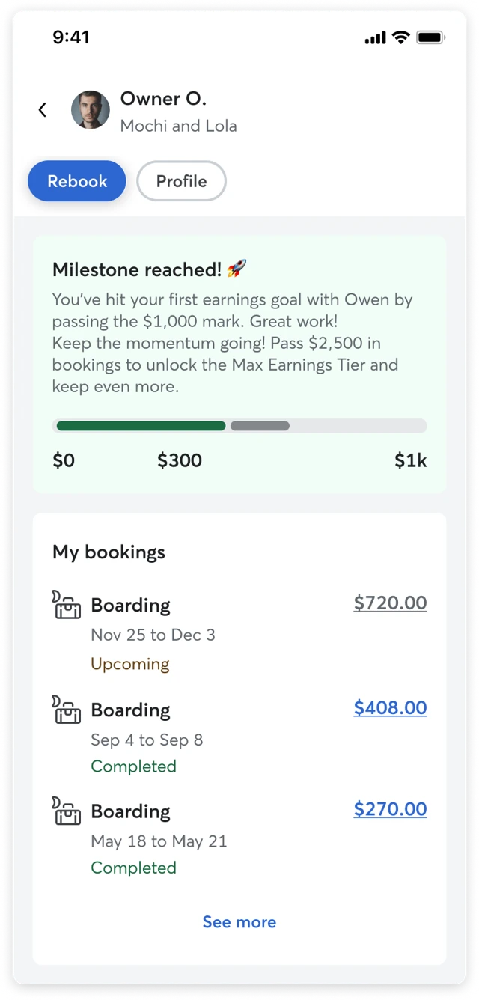

# MVP: relationship page

**URL:** https://roverdotcom.atlassian.net/wiki/spaces/PSD/pages/5241569569  
**Author:** Bernardo Prudêncio | **Last modified:** Feb 09, 2026

---

## Context

This document defines what we consider an MVP for the Relationship page touchpoint, as outlines in the design exploration. This page is a critical component on the relationship based, GBV milestone model. It will be the "source of truth" for a sitter's progress with a specific client and will be accessed from the conversation, booking details, rebook, etc.

## Problem

Our relationship based model is fundamentally dependent on a sitter's ability to track their progress with each individual client. Currently, this is impossible.

1. Without this page, the new fee structure will be hard to understand. A sitter will not understand why their is higher with one client and lower with another, leading to confusion and eroding trust.
2. If sitters can't see their progress towards the next milestone, they can't be motivated by it. The drive to keep bookings on platform is lost.
3. When a sitter's fee doesn't match their expectation (e.g:. a cancellation wasn't counted), they have no way to _check the math._ This will lead to an increase in frustration.

## MVP

To solve these problems, the MVP myst be focused on providing clarity, transparency, and motivation for the new fee system.

It must answer three questions:

1. What is my fee right now with this client?
2. What bookings or cancellation contributed for me to get to this fee?
3. How do I get to the next lower fee?

To do this, the MVP must include **must** components. Everything else is deprioritized from the MVP, as it doesn't directly support the core function of the fee model. The relationship page could eventually evolve into a rich space, but this isn't needed for the test.

| **Component** | **Prio** | **Notes** |
| --- | --- | --- |
| Client identification | must | Clear identification of client and pets. |
| Current status | must | What fee tier is the sitter when booking with this client. |
| Progress to next milestone | must | Progress bar showing the GBV earned and needed to reach the next tier. |
| Actionable CTA | must | Rebook or Message client button to act on this information. |
| Transaction history | must | "Proof" for transparency. It can be a simple, read-only list of the only transactions that count toward GBV. |
| Booking details navigation | should | Useful to provide more info without creating added complexity on the page. |
| Upcoming | should | Useful to have visibility on which booking will be at a lower rate. |
| Requests | should | Useful to have visibility on which requests could be at a lower rate. |
| Refunds | should | A refund can make the progress bar go down making them a component of the transaction history. |
| Locked rates | could | Allow sitters to manage locked rates on a client basis, not booking basis as today. Enable added, edit, remove capabilities. |
| Access to owner profile | could |  |
| Block and report | could |  |
| Bookings actions | won't | Enable sitters/owners booking or archiving, or trainer scheduling sessions. |
| Celebratory milestones | won't |  |
| Advanced analytics | won't |  |
| Conversations | won't | Aggregate all conversations. Dependent on Inbox filtering. |
| Starred messages | won't | Aggregate messages that were starred through all conversations. |
| Media gallery | won't | Aggregate all media from all conversations. |
| Rover Cards | won't | Aggregate all Rover Cards from all bookings. |
| Links and docs | won't | Aggregate all links and docs from all conversations (e.g:. vet info) |
| Private notes | won't | Useful for door codes, etc. |
| Notification preferences | won't |  |
| Rover Number preferences | won't |  |

[Figma explorations](https://www.figma.com/design/E2bbKATUHaKb79E44ygxTe/%F0%9F%93%81-Touchpoints?node-id=738-61311&t=NymwNLyiCXVqK0nL-4) — Open in Figma to see other high level explorations.
